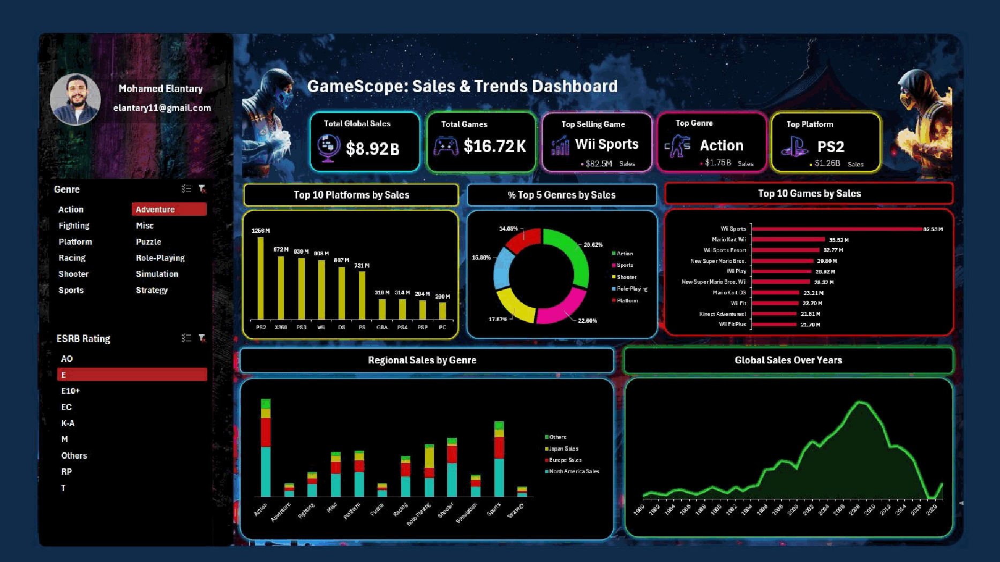
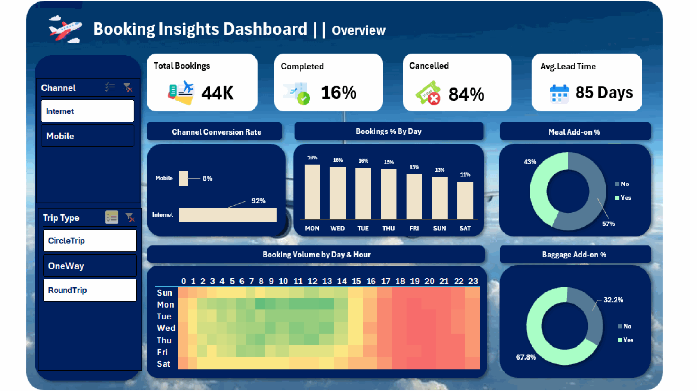
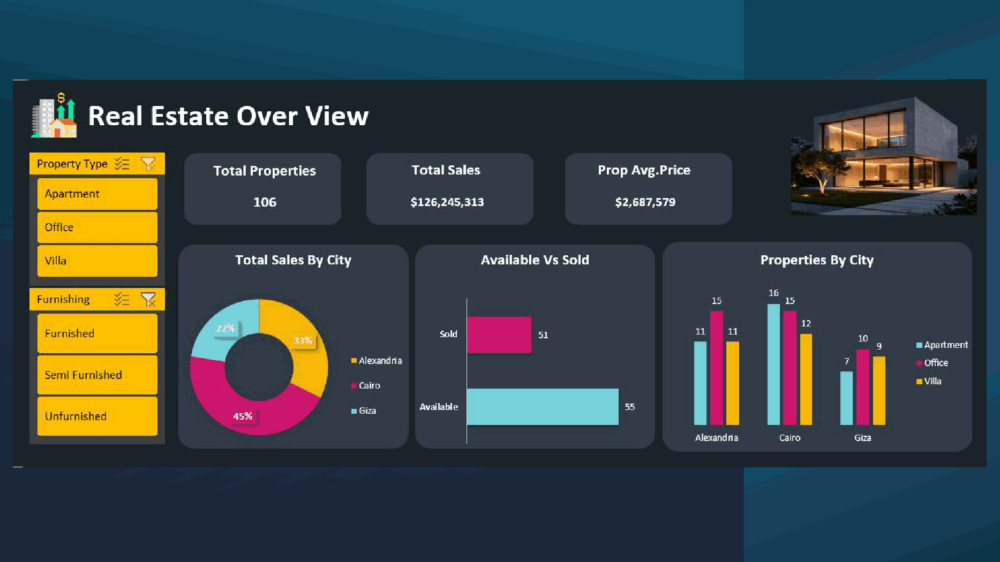

# Excel Business Analytics Portfolio

## Interactive Dashboards for Gaming, Aviation and Real Estate

This portfolio contains three Excel dashboard projects built across different business domains. Each dashboard starts with a different operational question, but the workflow is consistent: prepare the data, define useful KPIs, create interactive analysis, and present the results in a clear business format.

## 1. Gaming Sales Analytics

### Scope

The dashboard analyzes approximately 8.92B in global sales across 16.72K game titles. It covers platforms, genres, titles, regions, and historical sales trends.

### Key KPIs

- Total global sales
- Number of game titles
- Top-selling game
- Top genre
- Top platform
- Regional sales contribution
- Sales performance over time

### Main insights

- Action is the leading genre, contributing approximately 1.75B in sales.
- PS2 is the strongest platform, with approximately 1.26B in sales.
- Wii Sports is the top-selling title at approximately 82.5M.
- Platform, genre, and regional comparisons help identify where historical demand was strongest.

### Business use

The dashboard can support portfolio planning, market comparison, and budget prioritization by showing which genres, platforms, and titles achieved the strongest historical demand.

## 2. Aviation Booking Analytics

### Scope

The dashboard analyzes 44K bookings, booking channels, trip types, lead time, daily and hourly booking patterns, cancellations, and optional service adoption.

### Key KPIs

- Total bookings
- Completed bookings
- Cancelled bookings
- Average booking lead time
- Booking channel share
- Bookings by day and hour
- Meal and baggage add-on rates

### Main insights

- The dataset records an 84% cancellation rate and a 16% completion rate.
- Average lead time is approximately 85 days.
- Internet bookings represent the dominant channel at approximately 92%.
- Baggage add-on adoption is approximately 67.8%.
- The day-and-hour heatmap helps identify periods of stronger booking activity.

### Business use

The report helps management monitor cancellation risk, understand channel behavior, plan marketing timing, and evaluate additional-service adoption.

## 3. Real Estate Performance

### Scope

The dashboard monitors a portfolio of 106 properties across Cairo, Alexandria, and Giza. It compares property type, furnishing status, city, sales value, and inventory availability.

### Key KPIs

- Total properties
- Total sales value
- Average property price
- Available versus sold units
- Sales by city
- Property mix by city and type

### Main insights

- The portfolio contains 106 properties and approximately 126.2M in total sales.
- Available inventory represents approximately 55 units compared with 51 sold units.
- Cairo, Alexandria, and Giza show different property and sales distributions.
- Property type and furnishing filters allow commercial teams to examine inventory at a more useful level.

### Business use

The dashboard supports inventory monitoring, location comparison, pricing review, and targeted sales activity for remaining properties.

## Excel Work Completed

- Prepared and organized the source data.
- Defined the KPIs required for each business domain.
- Created PivotTables and PivotCharts.
- Added slicers and interactive filtering.
- Designed domain-specific layouts and visual hierarchies.
- Reviewed the dashboards for consistent calculations and usability.

## Tools and Skills

`Microsoft Excel` `PivotTables` `PivotCharts` `Slicers` `KPI Design` `Data Cleaning` `Business Analysis`

## Repository Content

- `assets/gamescope.png` - gaming sales dashboard
- `assets/booking-insights.png` - aviation booking dashboard
- `assets/real-estate.png` - real estate dashboard
- `project-overview.pdf` - complete visual portfolio

## Important Note

The figures and recommendations shown here are based on the supplied portfolio datasets and are intended to demonstrate Excel analytics and dashboard development skills.

---

Built by **Mohamed Elantary**.
